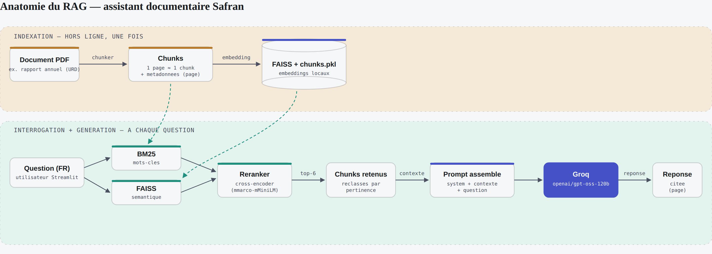

# Assistant documentaire RAG

Assistant conversationnel qui répond à des questions sur un document
d'entreprise (rapport, manuel, procédure...) en citant ses sources —
architecture Retrieval-Augmented Generation, inspirée des cas d'usage
qu'on trouve chez un industriel (finance, conformité, sécurité).

> Pourquoi ce projet : pouvoir interroger un document de 100+ pages en
> langage naturel, avec des réponses **sourcées et traçables**, plutôt que
> de dérouler le PDF à la main. Voir la feuille de route complète du
> projet (choix du corpus, évaluation, présentation) dans le guide fourni
> à côté de ce dépôt.

## Architecture



Deux temps : l'**indexation** (en haut) ne tourne qu'une fois — le document
est découpé, vectorisé et rangé dans FAISS. L'**interrogation** (en bas)
tourne à chaque question — recherche hybride (mots-clés + sémantique),
reranking, puis génération par le LLM à partir des seuls extraits retenus.

- **Embeddings** : `sentence-transformers/paraphrase-multilingual-MiniLM-L12-v2`,
  local et gratuit (pas de clé API pour cette étape).
- **Vector store** : FAISS, local, persisté dans `data/index/`.
- **Recherche hybride** : BM25 (mots-clés, via `rank_bm25`) + FAISS
  (sémantique) combinés avec `EnsembleRetriever`, puis reclassés par un
  cross-encoder multilingue (`cross-encoder/mmarco-mMiniLMv2-L12-H384-v1`)
  — voir `rag/retriever.py`. Nécessaire sur un document dense où plusieurs
  passages se ressemblent lexicalement (ex. plusieurs fiches biographiques
  avec la même structure).
- **LLM** : Groq — `openai/gpt-oss-120b` par défaut, configurable via `.env`
  (`GROQ_MODEL`), gratuit en usage modéré, très rapide — idéal pour une
  démo réactive.
- **Interface** : Streamlit, chat avec affichage des sources par réponse.

## Stack technique

`langchain` · `langchain-groq` · `langchain-huggingface` · `faiss-cpu` ·
`sentence-transformers` · `rank_bm25` · `streamlit`

## Lancer en local (VSCode)

> **Prérequis : Python 3.11 ou 3.12.** Les dépendances ML (numpy, torch,
> sentence-transformers, faiss-cpu) n'ont pas toujours de wheel précompilée
> pour les versions de Python très récentes (3.13+) — pip tente alors de
> compiler depuis les sources et échoue sans Visual Studio Build Tools.
> Vérifie tes versions installées avec `py -0` avant de créer le venv.

1. Ouvre ce dossier dans VSCode.
2. Terminal VSCode :
   ```bash
   py -3.11 -m venv .venv
   # Windows : .venv\Scripts\activate
   # macOS/Linux : source .venv/bin/activate
   pip install --upgrade pip
   pip install -r requirements.txt
   ```
3. Copie `.env` et colle ta clé Groq gratuite
   (https://console.groq.com/keys).
4. Décompresse ton zip de documents dans `data/raw/` (PDF, DOCX ou TXT).
5. Construis l'index :
   ```bash
   python -m rag.ingest_and_index
   ```
6. Lance l'app :
   ```bash
   streamlit run app.py
   ```

## Limites & pistes d'amélioration

- Pas d'évaluation chiffrée automatisée (RAGAS) — à ajouter dans
  `evaluation/` avant la version portfolio finale.
- En environnement d'entreprise (Safran/Renault/TotalEnergies), ce pipeline
  s'appuierait plutôt sur Azure AI Search / OpenSearch et un LLM hébergé
  dans le tenant du groupe, pour des raisons de résidence des données.
